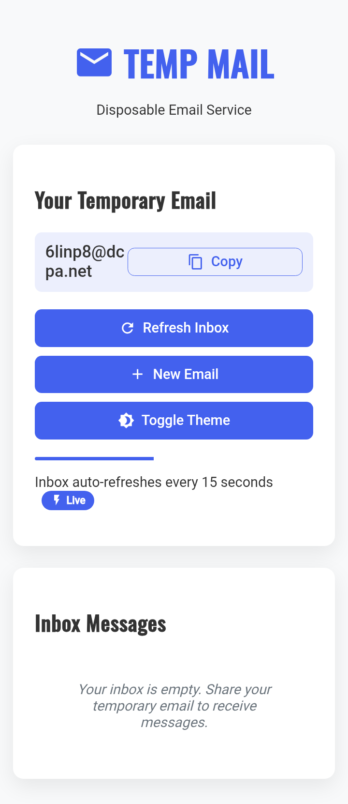

# 📧 Temp Mail - Mail.tm API Client  

A lightweight, privacy-focused temporary email client built with the official [Mail.tm API](https://docs.mail.tm/). Generate disposable email addresses instantly and manage your inbox without compromising your real email.

 *(replace with actual screenshot)*

## ✨ Features

**Core Functionality**
- 🚀 Instant disposable email generation
- 📬 Real-time inbox monitoring
- 🔍 View full email content (HTML/text)
- 🔄 Auto-refresh every 15 seconds

**Security & Privacy**
- 🔒 No tracking or analytics
- 🛡️ Session-based authentication
- 🗑️ Automatic account cleanup

**User Experience**
- 🌓 Dark/light mode toggle
- 📱 Fully responsive design
- 📋 One-click email copying
- 🔔 New email notifications

## 🛠️ Technology Stack
- Vanilla JavaScript (no frameworks)
- Mail.tm REST API
- Modern CSS (Flexbox/Grid)
- Material Icons

## 🚀 Quick Start
1. Use instantly: [Live Demo Link](https://agaggsgsfsfwcau.github.io/tempmail/)
2. Or clone locally:
```bash
git clone https://github.com/agaggsgsfsfwcau/tempmail.git
open index.html
```

## 📜 License
MIT Licensed - Free for personal and commercial use

---

### Why This Project?
- 100% client-side (no server needed)
- Open source alternative to webmail sites
- Perfect for testing, signups, and privacy protection

---
